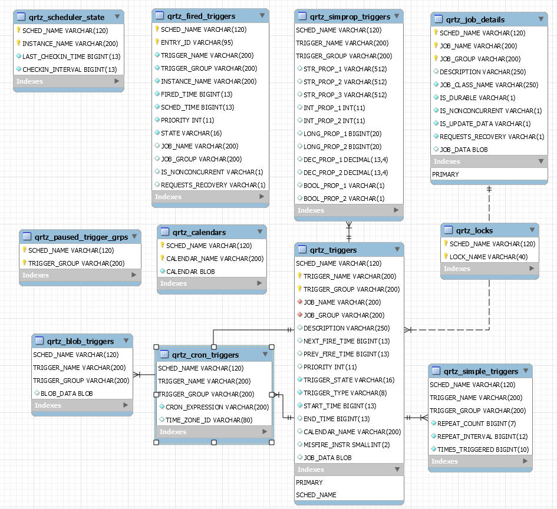
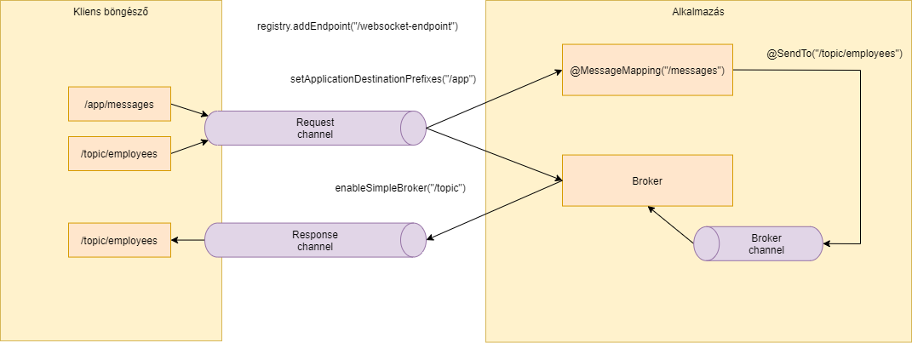
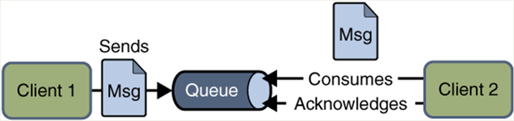
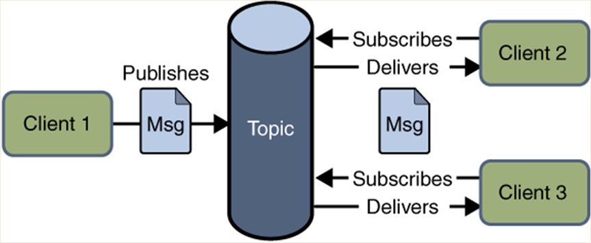

class: inverse, center, middle

# Haladó Spring keretrendszer eszközök

---

class: inverse, center, middle

# Spring Data JPA audit

---

## Auditálás fogalma ORM esetén

* Ki és mikor módosította utoljára az entitást
* Az entitás előző verziójának adatainak eltárolása

---

## Lehetséges implementációk

* Adatbázis szinten: trigger
* JPA szinten: entitás életciklusához kötve, `@PrePersist`, `@PreUpdate` és `@PreRemove`
* Spring Data JPA [Auditing](https://docs.spring.io/spring-data/jpa/docs/current/reference/html/#auditing), csak az aktuális entitáshoz hozzáfűzött információk
* Hibernate Envers
* EclipseLink [History](https://wiki.eclipse.org/EclipseLink/Examples/JPA/History)

---

## Spring Data JPA Auditing

```java
@Entity
@EntityListeners(AuditingEntityListener.class)
public class Employee {

    @Id
    private Long id;

    private String name;

    @CreatedDate
    private LocalDateTime createdAt;

    @LastModifiedDate
    private LocalDateTime lastModifiedAt;
}
```

---

## Auditálás bekapcsolása

* `@EnableJpaAuditing` annotáció Java konfigurációnál konfigurációs osztályon

---

## Entity listener aktiválása <br /> globálisan

`orm.xml` állományban:

```xml
<persistence-unit-metadata>
  <persistence-unit-defaults>
    <entity-listeners>
      <entity-listener class="org.springframework.data.jpa.domain.support.AuditingEntityListener" />
    </entity-listeners>
  </persistence-unit-defaults>
</persistence-unit-metadata>
```

---

## Felhasználó feloldása

```java
@CreatedBy
private String createdBy;

@LastModifiedBy
private String lastModifiedBy;
```

Feloldás:

```java
@Component
public class StubAuditorAware implements AuditorAware<String> {

    @Override
    public Optional<String> getCurrentAuditor() {
        return Optional.of("admin");
    }
}
```

---

## Felhasználó feloldása <br /> Spring Security esetén

```java
public class SpringSecurityAuditorAware implements AuditorAware<User> {

  public Optional<User> getCurrentAuditor() {

    return Optional.ofNullable(SecurityContextHolder.getContext())
			  .map(SecurityContext::getAuthentication)
			  .filter(Authentication::isAuthenticated)
			  .map(Authentication::getPrincipal)
			  .map(User.class::cast);
  }
}
```

---

class: inverse, center, middle

# Hibernate Envers

---

## Hibernate Envers

* Entitások auditálására
* Revízió (revision) fogalma:  minden tranzakció, mely auditálandó entitást szúr be, módosít vagy töröl, kap egy
egyedi revision számot
* Külön táblában tárolja: azonosító és dátum mezőkkel
* Plusz entitásonként külön audit tábla
* Külön lekérdezési lehetőség az auditált adatokra
* Részletes [dokumentáció](https://docs.jboss.org/envers/docs/)

---

## Függőség

`pom.xml`

```xml
<dependency>
	<groupId>org.hibernate</groupId>
	<artifactId>hibernate-envers</artifactId>
</dependency>
```

---

## Hibernate Envers entitás

```java
@Entity
@Audited
public class Employee {

    @Id
    private Long id;

}
```

---

## Kapcsolódó entitások

```plaintext
Caused by: org.hibernate.MappingException: An audited relation
from empapp.Employee.addresses to a not audited entity empapp.Address!
```

`@NotAudited` a relációra, vagy `@Audited` a kapcsolódó entitásra

---

## Táblák

* `revinfo` közös tábla a revision tárolására
    * `rev` mező, revision azonosítója
    * `revtstmp` mező, a változás dátumának tárolására
* Entitás verzióinak tárolására az eredetivel megegyező tábla, `_AUD` posztfixszel
    * `rev` mező, külső kulcs a `revinfo` táblára
    * `revtype` mező, létrehozás (`0` - `ADD`), módosítás (`1` - `MOD`), törlés (`2` - `DEL`)

---

## Lekérdezések AuditReaderrel

```java
AuditReader reader = AuditReaderFactory.get(em);
List<Number> revisionNumbers = reader.getRevisions(Employee.class, id);
List<Employee> employeeHistory = revisionNumbers.stream()
        .map(rev -> reader.find(Employee.class, id, rev))
        .collect(Collectors.toList());
```

---

## Összetett lekérdezési lehetőségek


```java
AuditReader reader = AuditReaderFactory.get(em);
List<Object[]> result = reader.createQuery()
  .forRevisionsOfEntity(Employee.class, false, true)
  .add(AuditEntity.id().eq(id)).getResultList();
```

* `forRevisionsOfEntity` paraméterezése
    * `selectEntitiesOnly`, `false` esetén három elemű tömb, ellenkező esetben az entitások verziói
```java
Employee employee = (Employee) row[0];
DefaultRevisionEntity revision = (DefaultRevisionEntity) row[1];        
RevisionType type = (RevisionType) row[2];
```

    * `selectDeletedEntities`, `true` esetén a törölt entitásokat is visszaadja

---

## Spring Data Envers

* [Reference Documentation](https://docs.spring.io/spring-data/envers/docs/current/reference/html/#reference)
* `RevisionRepository` interfész, mely megkönnyíti a lekérdezést

---

## Saját mező a revision táblába

* Pl. mentést végző bejelentkezett felhasználó
* Saját entitás osztály definiálása, két lehetőség:
  * Leszármazás a `DefaultRevisionEntity` osztálytól
  * Annotációkkal megjelölt mezők
* Utána a lekérdezéseknél is erre kell típuskényszeríteni tömb esetén

---

## Saját revision entitás

```java
@Entity
@RevisionEntity(StubUsernameListener.class)
@Data
public class EmployeeRevisionEntity {

    @Id
    @GeneratedValue(strategy = GenerationType.IDENTITY)
    @RevisionNumber
    private int id;

    @RevisionTimestamp
    private Date revisionDate;

    private String username;
}
```

* `@RevisionTimestamp` csak `long`, `Date`, `Timestamp`

---

## Listener a plusz mező beállításra

```java
public class StubUsernameListener implements RevisionListener {

    @Override
    public void newRevision(Object o) {
        if (o instanceof EmployeeRevisionEntity revision) {
            revision.setUsername("admin");
        }
    }
}
```

---

## Személyreszabás

* Tábla neve: `@AuditTable`, `@SecondaryAuditTable`
* Mezők nevei: `@AuditOverride`

---

class: inverse, center, middle

# Ütemezés

---

## Ütemezett feladatok

* `TaskExecutor` és `TaskScheduler` interfészek
* `TaskExecutor` - thread pool absztrakciója
* `TaskScheduler` - ütemezésre
* Elrejti a Java SE 5, Java SE 6, és Java EE közötti különbségeket

---

## TaskExecutor

* Különböző implementációk, pl.:
    * `SyncTaskExecutor` - azonos szálon
    * `SimpleAsyncTaskExecutor` - külön szálon, mindig új szál
    * `ThreadPoolTaskExecutor` - thread pool
* Spring Boot automatikusan konfigurál egyet
    * A `spring.task.execution.pool` property-kkel személyre szabható
* Programozott felülírás `TaskExecutorBuilder` segítségével
* Több is konfigurálható

---

## Deklaratív async execution

* `@Configuration` annotációval ellátott osztályon `@EnableAsync` annotáció
* Metóduson `@Async` annotáció
* Visszatérési típus lehet `Future`, `ListenableFuture` vagy `CompletableFuture`

```java
@Async
public Future<Integer> count() {
    // int n = ...
    return new AsyncResult(n);
}
```

---

## Kivételkezelés

```java
public class CustomAsyncExceptionHandler
  implements AsyncUncaughtExceptionHandler {

    @Override
    public void handleUncaughtException(
      Throwable throwable, Method method, Object... parameters) {
        log.error("Exception in async task", throwable);
    }

}
```

---

## Programozott async execution

```java
// Injektálható
private TaskExecutor taskExecutor;

public void sayHello() {
  taskExecutor.execute(() -> log.info("Hello World"));
}
```

---

## TaskScheduler

* Különböző implementációk, pl.:
    * `ThreadPoolTaskScheduler`, mely egy `ScheduledExecutorService` példányhoz delegál
* Spring Boot automatikusan konfigurál egyet
    * A `spring.task.scheduling` property-kkel személyre szabható
* Programozott felülírás `TaskSchedulerBuilder` segítségével
* Több is konfigurálható
* Megadható
  * Adott időben
  * Adott idő múlva (`fixedDelay`)
  * Adott időközönként (`fixedRate` és `initialDelay`)
  * `Trigger` példánnyal, bármilyen feltétel alapján - tipikus implementációja a `CronTrigger`

---

## Deklaratív scheduling

* `@Configuration` annotációval ellátott osztályon `@EnableScheduling` annotáció

```java
@Scheduled(fixedRate = 5000) // 5 másodpercenként
public void logCount() {
    // ...
}
```

```java
@Scheduled(cron = "*/10 * * * * ?") // 10 másodpercenként
public void logCount() {
    // ...
}
```

---

## Cron formátum

* `1` - Second (0–59)
* `2` - Minute (0–59)
* `3` - Hour (0–23)
* `4` - Day of month (1–31)
* `5` - Month (1–12 vagy JAN–DEC)
* `6` - Day of week (1–7 vagy SUN–SAT)
* `7` - Year (opcionális) (1970–2099)

---

## Cron haladó

* `*` - minden érték
* `6-10` - range
* `6,8,10` - list
* `*/10` - minden 10. másodpercben
* `?` - day of month vagy week (az egyik helyén, ha megadjuk a másikat)

---

## Programozott scheduling

```java
// Injektálható
private TaskScheduler taskScheduler;

public void log() {
  // taskScheduler.schedule() - Date, Instant
  // taskScheduler.schedule(new CronTrigger("*/10 * * * * ?"))
  // taskScheduler.scheduleWithFixedDelay()
  taskScheduler.scheduleAtFixedRate(() -> System.out.println(command.getName()), 5000);  
}
```

* `Runnable` paraméter

---

class: inverse, center, middle

# Ütemezés Quartz használatával

---

## Quartz

* Ütemezés nagyvállalati környezetben
* Perzisztencia adatbázisban
* JTA tranzakciókezelés
* Clustering (failover, load balancing)
* Naptárkezelés, szabadnapok
* Job listener komplex workflow létrehozására
* Plugins, pl. history-ra
* Trigger prioritás
* Terracotta perzisztencia

---

## Quartz függőség

* A `pom.xml` fájlban:

```xml
<dependency>
	<groupId>org.springframework.boot</groupId>
	<artifactId>spring-boot-starter-quartz</artifactId>
</dependency>
```

---

## Job

```java
@AllArgsConstructor
public class EmployeeJob extends QuartzJobBean {

    private EmployeeService employeeService;

    @Override
    protected void executeInternal(JobExecutionContext context) throws JobExecutionException {
        List<EmployeeDto> employees = employeeService.listEmployees();
        // String value = context.getMergedJobDataMap().getString("key1");
        System.out.println("Running cron job, employees " + employees.size());
    }
}
```

* Működik a Dependency Injection

---

## JobDetail

```java
@Bean
public JobDetail buildJobDetail() {
    JobDetail jobDetail = JobBuilder.newJob(EmployeeJob.class)
            .withIdentity(UUID.randomUUID().toString(), "employees-job")
            .withDescription("Print employees Job")
            //.usingJobData("key1", "value1")
            .storeDurably()
            .build();
    return jobDetail;
}
```

---

## Trigger

```java
@Bean
public Trigger buildJobTrigger(JobDetail jobDetail) {
    return TriggerBuilder.newTrigger()
            .forJob(jobDetail)
            .withIdentity("PrintEmployeesCountJob")
            .withDescription("Print employees Trigger")
            .withSchedule(CronScheduleBuilder.cronSchedule("*/10 * * * * ?"))
            .build();
}
```

* Vagy `SimpleScheduleBuilder`

---

class: inverse, center, middle

# Quartz adatbázis perzisztencia

---

## Adatbázis perzisztencia

* Az `application.properties` fájlban

.small-code-14[
```properties
spring.quartz.job-store-type=jdbc
spring.quartz.properties.org.quartz.jobStore.class=org.springframework.scheduling.quartz.LocalDataSourceJobStore
```
]

* SQL fájlok a `\org\quartz\impl\jdbcjobstore` könyvtárban
    * Flyway vagy Liquibase
* Quartz maga inicializálja

```properties
spring.quartz.jdbc.initialize-schema=always
```

* Postgres esetén

.small-code-14[
```properties
spring.quartz.properties.org.quartz.jobStore.driverDelegateClass=org.quartz.impl.jdbcjobstore.PostgreSQLDelegate
```
]

---

## Adatbázis táblák



---

## Adatbázis táblák leírása

* `qrtz_job_details` - job adatai
* `qrtz_triggers` - trigger adatai
* `qrtz_simple_triggers`, `qrtz_simprop_triggers`, `qrtz_crons_triggers`, `qrtz_blob_triggers` - megfelelő típusú triggerek
  specifikus adatai, külső kulccsal hivatkoznak a `qrtz_triggers` táblára
* `qrtz_fired_triggers` - elindított triggerek adatai
* `qrtz_paused_trigger_grps` - nem aktív triggerek adatai
* `qrtz_calendars` - ünnepnapok tárolására
* `qrtz_lock` - clusteres működés esetén erre történik a lockolás, hogy egyszerre csak egy node-on fusson
* `qrtz_scheduler_state` - clusteres működés esetén ide kerül tárolásra a node-ok adatai, hogy az aktív node kiesése esetén át tudja venni egy passzív node

---

class: inverse, center, middle

# Quartz clusterezés

---

## Clusteres környezetben

* Csak egy node futtassa a jobot
* Ugyanaz a `JobDetail` identity

```java
JobDetail jobDetail = JobBuilder.newJob(EmployeeJob.class)
                .withIdentity("PrintEmployeesCountJob")
```

* `application.properties` változtatások

.small-code-14[
```properties
spring.quartz.properties.org.quartz.jobStore.class=org.springframework.scheduling.quartz.LocalDataSourceJobStore
spring.quartz.properties.org.quartz.jobStore.isClustered=true
spring.quartz.properties.org.quartz.jobStore.clusterCheckinInterval=5000
```
]

---

class: inverse, center, middle

# Cache abstraction

---

## Cache abstraction

* Objektumok memóriában megőrzése
* Nem kell újra lekérni, pl. adatbázisból, hálózatról
* Deklaratív módon
    * Spring saját megoldása
    * JSR-107 szabány (JCache)
* Különböző implementációk konfigurálhatóak be
* Metódushívás eredménye cache-elhető a paraméterek függvényében

---

## Cache-elés beállítása

```java
@Configuration
@EnableCaching
public class CacheConfig {

}
```

Alapesetben egy `ConcurrentMap` alapú implementáció

---

## Cache-elés metódus szinten

```java
@Cacheable("employee")
public EmployeeDto findEmployeeById(long id) {
  // ...
}
```

* Kulcs: `Long`, érték: `EmployeeDto`

---

## Cache-elés személyre szabása

* `key`: Spring EL-el megadható mi legyen a kulcs
* `keyGenerator`: kulcsgenerálás programozott módon `org.springframework.cache.interceptor.KeyGenerator` interfész implementációval
* `condition`: csak bizonyos feltétel mellett kerüljön be (Spring EL, pl `#page < 5`)
* `unless`: amikor a visszatérési érték nem cache-elhető (Spring EL)
* `sync`: szinkronizált

---

## Cache törlése

```java
@CacheEvict(value = "employees", allEntries = true)
// @CacheEvict(value = "employee", key = "#id")
@CachePut(value = "employee", key = "#id")
public EmployeeDto updateEmployee(long id, UpdateEmployeeCommand command) {
  // ...
}
```

* `@CacheEvict` `allEntries` paraméterrel töröl mindent
* `@CacheEvict` csak a kulccsal megadott értéket törli
* `@CachePut` mindig megtörténik a hívás, a visszatérési értéket azonnal elhelyezi a cache-ben

Visszatérési érték is hivatkozható a `result`-tal:

```java
@CachePut(value = "employee", key = "#result.id")
public EmployeeDto createEmployee(CreateEmployeeCommand command) {
  // ...
}
```

---

## Üres és összetett kulcs

* Üres kulcs: `SimpleKey[]`
* Összetett kulcs megadása EL-ben, több paraméterre hivatkozva: `{#id, #type}`

---

## Több annotáció használata

* Nincs `@Repeatable`

```java
@Caching(evict = {
        @CacheEvict(value = "employees", allEntries = true),
        @CacheEvict(value = "employee", key = "#id")
})
```

---

## Cache műveletek naplózása

```properties
logging.level.org.springframework.cache=trace
```

---

## Konfiguráció megadása <br /> osztály szinten

* Csak a konfiguráció, nem állit be cache-elést
* Összes annotációval ellátott metódusra vonatkozik
* `@CacheConfig` annotációval

---

## Programozott hozzáférés

```java
// Injektálható
private CacheManager cacheManager;

public void evictSingleCacheValue(String cacheName, String cacheKey) {
    cacheManager.getCache(cacheName).evict(cacheKey);
}
```

---

class: inverse, center, middle

# Ehcache

---

## Ehcache függőség

```xml
<dependency>
  <groupId>org.springframework.boot</groupId>
  <artifactId>spring-boot-starter-cache</artifactId>
</dependency>
<dependency>
  <groupId>javax.cache</groupId>
  <artifactId>cache-api</artifactId>
</dependency>
<dependency>
  <groupId>org.ehcache</groupId>
  <artifactId>ehcache</artifactId>
</dependency>
```

---

## Ehcache konfiguráció

.small-code-14[
```xml
<config xmlns:xsi="http://www.w3.org/2001/XMLSchema-instance"
        xmlns="http://www.ehcache.org/v3"
        xmlns:jsr107="http://www.ehcache.org/v3/jsr107"
        xsi:schemaLocation="
            http://www.ehcache.org/v3 http://www.ehcache.org/schema/ehcache-core-3.0.xsd
            http://www.ehcache.org/v3/jsr107 http://www.ehcache.org/schema/ehcache-107-ext-3.0.xsd">

    <cache-template name="default">
        <resources>
            <heap unit="MB">10</heap>
            <offheap unit="MB">20</offheap>
        </resources>
    </cache-template>

    <cache alias="employee" uses-template="default">
        <key-type>java.lang.Long</key-type>
        <value-type>empapp.EmployeeDto</value-type>
    </cache>

    <cache alias="employees" uses-template="default">
        <value-type>java.util.List</value-type>
    </cache>
</config>
```
]

---

## Ehcache konfiguráció aktiválása

* Az `application.properties` állományban:

```properties
spring.cache.jcache.config=classpath:ehcache.xml
```

* A cache-ben tárolandó objektumok legyenek szerializálhatóak!
* Az Ehcache cache típusbiztos

---

## Ehcache listener

```java
public class CacheEventLogger implements CacheEventListener<Object, Object> {

    @Override
    public void onEvent(CacheEvent<?, ?> cacheEvent) {
        log.info("Key: {} | EventType: {} | Old value: {} | New value: {}",
                cacheEvent.getKey(), cacheEvent.getType(), cacheEvent.getOldValue(),
                cacheEvent.getNewValue());
    }
}
```

---

## Ehcache listener bekötése

* Az `ehcache.xml` fájlban:

```xml
<listeners>
    <listener>
        <class>empapp.CacheEventLogger</class>
        <event-firing-mode>ASYNCHRONOUS</event-firing-mode>
        <event-ordering-mode>UNORDERED</event-ordering-mode>
        <events-to-fire-on>CREATED</events-to-fire-on>
        <events-to-fire-on>EXPIRED</events-to-fire-on>
        <events-to-fire-on>EVICTED</events-to-fire-on>
        <events-to-fire-on>REMOVED</events-to-fire-on>
        <events-to-fire-on>UPDATED</events-to-fire-on>
    </listener>
</listeners>
```

---

## Exception

```plain
java.lang.reflect.InaccessibleObjectException: Unable to make field transient java.lang.Object[] 
java.util.ArrayList.elementData accessible: module java.base does not "opens java.util" to 
unnamed module @11758f2a
```

```shell
--add-opens=java.base/java.util=ALL-UNNAMED --add-opens=java.base/java.lang=ALL-UNNAMED
```

---

## Java config

.small-code-12[
```java
@Configuration
public class CacheConfig {

    @Bean
    public org.springframework.cache.CacheManager cacheManager() {
        CachingProvider provider = Caching.getCachingProvider();
        CacheManager cacheManager = provider.getCacheManager();

        ResourcePoolsBuilder resourcePoolsBuilder = ResourcePoolsBuilder.newResourcePoolsBuilder()
                .heap(10, MB).offheap(20, MemoryUnit.MB);

        Set<EventType> eventTypes = new HashSet<>(Arrays.asList(EventType.CREATED, EventType.EXPIRED, EventType.EVICTED, 
            EventType.REMOVED, EventType.UPDATED));
        CacheEventListenerConfigurationBuilder asynchronousListener = CacheEventListenerConfigurationBuilder
                .newEventListenerConfiguration(new CacheEventLogger()
                        , eventTypes).unordered().asynchronous();

        CacheConfigurationBuilder<SimpleKey, List> config1 = CacheConfigurationBuilder
            .newCacheConfigurationBuilder(SimpleKey.class, List.class,
                resourcePoolsBuilder).withService(asynchronousListener);

        cacheManager.createCache("employees", Eh107Configuration.fromEhcacheCacheConfiguration(config1));

        CacheConfigurationBuilder<Long, EmployeeDto> config2 = CacheConfigurationBuilder
            .newCacheConfigurationBuilder(Long.class, EmployeeDto.class,
                resourcePoolsBuilder).withService(asynchronousListener);

        cacheManager.createCache("employee", Eh107Configuration.fromEhcacheCacheConfiguration(config2));

        return new JCacheCacheManager(cacheManager);
    }

}
```
]

---

class: inverse, center, middle

# Cache Redis használatával

---

## Redis

```shell
docker run --name employees-redis -p 6379:6379 -d redis
docker exec -it employees-redis redis-cli ping
docker exec -it employees-redis redis-cli --scan
docker exec -it employees-redis redis-cli get employee::1  
docker exec -it employees-redis redis-cli get "employees::SimpleKey []"
```

---

## Függőségek és konfiguráció

```xml
<dependency>			
    <groupId>org.springframework.boot</groupId>
    <artifactId>spring-boot-starter-data-redis</artifactId>
</dependency>
```

* `Serializable` objektumok

Az `application.properties`:

```properties
spring.cache.cache-names=employees,employee
spring.cache.redis.time-to-live=10m
```

---

class: inverse, center, middle

# Cache actuators

---

## Actuator konfigurálása

```xml
<dependency>
  <groupId>org.springframework.boot</groupId>
  <artifactId>spring-boot-starter-actuator</artifactId>
</dependency>
```

* Az `application.properties` állományban:

```properties
management.endpoints.web.exposure.include=*

spring.cache.redis.enable-statistics=true
```

---

## Actuator lekérdezések

* `http://localhost:8080/actuator/metrics`
    * `cache.puts`, `cache.evictions`, `cache.gets`, `cache.removals`
* `http://localhost:8080/actuator/metrics/cache.gets`
* `http://localhost:8080/actuator/metrics/cache.gets?tag=name:employee`


---

class: inverse, center, middle

# HTTP cache-elés

---

## HTTP cache mechanizmusok

* `Cache-Control` http fejléc
* `ETag` http fejléc
* Változott erőforrás más címen publikálása

---

##  `Cache-Control` http fejléc

* `max-age` érték, meddig tárolható lokálisan
* `no-store` nem cache-elhető tartalom
* `no-cache` cache-elheti, de minden esetben kérdezze meg a szervert, hogy van-e újabb
* `private` közbülső eszközök, pl. proxy nem cache-elheti

---

## ETag

* `ETag` header a válaszban, mely egy azonosítót rendel az erőforráshoz
* Böngésző `If-none-match` headerben elküldi a nála tárolt resource verziószámát
* Szerver vagy `304 Not Modified` státuszt küld vissza, vagy a kért erőforrást

---

## Változott erőforrás <br /> címének módosítása

* Az erőforrások címében változó tartalom
  * Pl. az alkalmazás verziószáma (pl. Git hash)
* Az erőforrásokra hivatkozásnál ezt fel kell oldani

---

## WebJars

```xml
<dependency>
	<groupId>org.webjars</groupId>
	<artifactId>bootstrap</artifactId>
	<version>4.5.2</version>
</dependency>

<dependency>
	<groupId>org.webjars</groupId>
	<artifactId>webjars-locator-core</artifactId>
</dependency>
```

```xml
<link th:src="@{/webjars/bootstrap/css/bootstrap.css}" rel="stylesheet">
```

---

## Cache-Control Spring Boot esetén

* Az `application.properties` állományban:

```properties
spring.web.resources.cache.cachecontrol.max-age=3600
```

---

## Content hash

* Tartalom alapján generál egy hash-t

```properties
spring.web.resources.chain.strategy.content.enabled=true
spring.web.resources.chain.strategy.content.paths=/**
```

---

## Verzió feloldása

```html
<script th:src="@{/js/app.js}"></script>
```

```html
<script src="/js/app-233be329c13ee19e25f2f6ccf84bf98d.js" ></script>
```

A `HttpServletResponse.encodeURL()` metódust egészíti ki egy `ResourceUrlEncodingFilter`

---

## Fixed version

```properties
spring.web.resources.chain.strategy.fixed.enabled=true
spring.web.resources.chain.strategy.fixed.paths=/**
spring.web.resources.chain.strategy.fixed.version=v12
```

```html
<script src="/v12/js/app.js"></script>
```

---

## Fixed version Git alapján

```xml
<plugin>
	<groupId>pl.project13.maven</groupId>
	<artifactId>git-commit-id-plugin</artifactId>
</plugin>
```

```java
@PropertySource("classpath:git.properties")
```

```properties
spring.web.resources.chain.strategy.fixed.version=${git.commit.id}
```

```html
<script src="/4918a4d480def57aad2e07531d06f970632f593a/js/app.js"></script>
```

---

## ETag

```java
@Bean
public FilterRegistrationBean<ShallowEtagHeaderFilter> etagFilter(){
    FilterRegistrationBean<ShallowEtagHeaderFilter> registrationBean
            = new FilterRegistrationBean<>();

    registrationBean.setFilter(new ShallowEtagHeaderFilter());
    registrationBean.addUrlPatterns("/js/*");

    return registrationBean;
}
```

```http
< ETag: "0233be329c13ee19e25f2f6ccf84bf98d"
```


---

## Dinamikus erőforrások <br /> cache-elése

```java
@GetMapping("/{id}")
public ResponseEntity<EmployeeDto> findEmployeeById(@PathVariable("id") long id) {
    EmployeeDto employeeDto = employeeService.findEmployeeById(id);
    return ResponseEntity
            .ok()
            .cacheControl(CacheControl.maxAge(1, TimeUnit.HOURS))
            // .eTag(Integer.toString(employeeDto.getVersion()))
            .eTag(Integer.toString(employeeDto.hashCode()))
            .body(employeeDto);
}
```

* Entitás verziószám (pl. JPA `@Version` annotáció), vagy `hashCode()` alapján

---

## ETag

```http
< ETag : "-802699320"
```

```http
> If-none-match : "-802699320"

< HTTP/1.1 304 Not Modified
```

Idézőjelek között

---

## Lost update problem

* Egyszerre két kliens szerkeszti az erőforrást
* Mind a kettő elmenti, akkor az első mentés "elveszik"
* Optimistic lockkal kivédhető
* Módosításkor is visszaküldeni az ETag értékét
* Ha nem azt küldi vissza, mint az aktuális, akkor `412 (Precondition Failed)` státuszkód

---

class: inverse, center, middle

# Aszinkron hívás

---

## Aszinkron hívás

* Servlet `startAsync()` támogatása
* Lassú válasz esetén a web konténer tehermentesítése
* A servlet kiszolgálószál felszabadul, a konténer thread poolja tehermentesítve
* A http kapcsolat nyitott marad, kliens és szerver közötti kommunikáció ugyanúgy szinkron
* Terhelés máshova helyezhető át (pl. külön thread pool)

---

## Spring támogatás

* Controllerből visszatérés `DeferredResult` példánnyal
* Controllerből visszatérés `Callable` példánnyal
* Visszatérés használati esetek:
    * Hosszú folyamat (számolás, külső erőforrás elérése, integráció más rendszerekkel - REST, SOAP, JMS - pl. megvárja a választ)    
    * IO intenzív operációk
    * Ütemező

---

## DeferredResult példa

```java
@GetMapping
public DeferredResult<Boolean> check() {
    System.out.println("Call service");
    DeferredResult<Boolean> deferredResult = new DeferredResult<>();
    // Külön szálon indítás, service a végén deferredResult.setResult(boolean) metódust hív
    checkAliveService.checkAlive("http://www.learnwebservices.com", deferredResult);    

    // Azonnal visszatér
    System.out.println("Return from service");
    return deferredResult;
}
```

---

## DeferredResult

* `onCompletion()`
* `onError()`
* `onTimeout()`
    * `DeferredResult<Boolean> deferredResult = new DeferredResult<>(3000L);`

---

class: inverse, center, middle

# Üzenet szerver oldalról

---

## Szerver oldali üzenetküldő <br /> megoldások

* Long polling
* WebSocket
* Server-Sents Events

---

## WebSocket

* Pehelysúlyú kommunikációs protokoll a TCP/IP felett
* Full-duplex
* HTTP Upgrade header HTTP protokollról WebSocketre váltásra, ugyanazon porton
* Kapcsolatfelvételt a kliens kezdeményezi, de utána kétirányú

---

## SockJS

* WebSocket emuláció
* Ha nem működik a WebSocket, pl. régi böngésző, vagy a proxy nem támogatja
* Szükség esetén visszavált alternatív protokollra, az API a WebSocket API marad (polling)

---

## STOMP

* Simple (or Streaming) Text Oriented Message Protocol
* MOM-okhoz való kapcsolódáshoz
* Nagyon hasonló a HTTP protokollhoz
* Frame-ekből áll
* Fejléc (kulcs-érték párok), törzs
* Parancsok, pl. `CONNECT`, `SEND`, `SUBSCRIBE`, stb.

---

## STOMP architektúra



---

## Spring konfiguráció

```java
@Configuration
@EnableWebSocketMessageBroker
public class WebSocketConfig implements WebSocketMessageBrokerConfigurer {

    @Override
    public void configureMessageBroker(MessageBrokerRegistry config) {
        config.enableSimpleBroker("/topic");
        config.setApplicationDestinationPrefixes("/app");
    }

    @Override
    public void registerStompEndpoints(StompEndpointRegistry registry) {
        registry.addEndpoint("/websocket-endpoint").withSockJS();
    }
}
```

---

## Spring controller

```java
@MessageMapping("/messages")
@SendTo("/topic/employees")
public Message sendMessage(MessageCommand command) {
    return new Message("Reply: " + command.getContent());
}
```

* `@MessageMapping` helyett `@SubscribeMapping` - csak a feliratkozó üzenetekre kerül meghívásra
* Alapesetben a `/topic/messages` (bejövő destination `/topic` prefix-szel) topicra válaszol, azonban ez felülírható a `@SendTo` annotációval

---

## JavaScript kliens - feliratkozás

```javascript
let socket = new SockJS('/websocket-endpoint');
     let stompClient = Stomp.over(socket);
     stompClient.connect({}, function (frame) {
        stompClient.subscribe('/topic/employees', function (message) {
            let content = JSON.parse(message.body).content;
            console.log(content);
        });
    });
```

---

## JavaScript kliens - küldés

```javascript
stompClient.send("/app/messages", {}, JSON.stringify({"content": content}));
```

---

## WebSocket függőség

```xml
<dependency>
	<groupId>org.springframework.boot</groupId>
	<artifactId>spring-boot-starter-websocket</artifactId>
</dependency>
```

* Tomcat implementációt használja WebSocket kezelésre

---

## JavaScript függőségek

```xml
<dependency>
	<groupId>org.webjars</groupId>
	<artifactId>sockjs-client</artifactId>
	<version>1.1.2</version>
</dependency>
<dependency>
	<groupId>org.webjars</groupId>
	<artifactId>stomp-websocket</artifactId>
	<version>2.3.3-1</version>
</dependency>
```

---

class: inverse, center, middle

# WebSocket üzenetküldés üzleti logikából

---

## WebSocket üzenetküldés

```java
@Controller
public class WebSocketMessageController {

    private SimpMessagingTemplate template;

    // ...

    public void send() {
      // message létrehozása

      template.convertAndSend("/topic/employees", message); // JSON marshal
    }

}
```

---

class: inverse, center, middle

# Spring Boot WebSocket kliens

---

## Parancssoros Spring Boot kliens

```java
@SpringBootApplication
public class EmployeeStompClient implements CommandLineRunner {

    public static void main(String[] args) {
        SpringApplication.run(EmployeeStompClient.class, args);
    }

    @Override
    public void run(String... args) throws Exception {
        // ...
    }
}
```

---

## WebSocket kliens

```java
//WebSocketClient client = new StandardWebSocketClient();
WebSocketClient client = new SockJsClient(
  List.of(new WebSocketTransport(new StandardWebSocketClient())));

WebSocketStompClient stompClient = new WebSocketStompClient(client);
stompClient.setMessageConverter(new MappingJackson2MessageConverter());

StompSessionHandler sessionHandler = new MessageStompSessionHandler();
stompClient.connect("ws://localhost:8080/websocket-endpoint", sessionHandler);

new Scanner(System.in).nextLine();
```

---

## StompSessionHandler

```java
public class MessageStompSessionHandler implements StompSessionHandler {

    public void afterConnected(StompSession stompSession, StompHeaders stompHeaders) {
        stompSession.subscribe("/topic/employees", this);
    }

    public Type getPayloadType(StompHeaders stompHeaders) {
            return Message.class;
    }
    
    public void handleFrame(StompHeaders stompHeaders, Object o) {
        String content = ((Message) o).getContent();
        // ...    
    }
}
```

---

## Hibakezelés

```java
public void handleException(StompSession stompSession, StompCommand stompCommand,
      StompHeaders stompHeaders, byte[] bytes, Throwable throwable) {
    throw new IllegalStateException("Exception by websocket communication", throwable);
}

public void handleTransportError(StompSession stompSession, Throwable throwable) {
    throw new IllegalStateException("Exception by websocket transport", throwable);
}
```

---

## Üzenet küldése


```java
ListenableFuture<StompSession> future = 
  stompClient.connect("ws://localhost:8080/websocket-endpoint", sessionHandler);
StompSession session = future.get(1000, TimeUnit.SECONDS);
// A MessageCommand JSON-be marshal-olható objektum
session.send("/app/messages", new MessageCommand(line));
```

---

## Függőségek

```xml
<dependency>
    <groupId>org.springframework.boot</groupId>
    <artifactId>spring-boot-starter-json</artifactId>
</dependency>
<dependency>
    <groupId>org.springframework</groupId>
    <artifactId>spring-websocket</artifactId>
    <version>4.3.25.RELEASE</version>
</dependency>
<dependency>
    <groupId>org.springframework</groupId>
    <artifactId>spring-messaging</artifactId>
    <version>4.3.25.RELEASE</version>
</dependency>
<dependency>
    <groupId>org.glassfish.tyrus.bundles</groupId>
    <artifactId>tyrus-standalone-client</artifactId>
    <version>1.15</version>
</dependency>
```

* [Tyrus](https://tyrus-project.github.io/) JSR 356: Java API for WebSocket - Reference Implementation

---

class: inverse, center, middle

# Server-Send Events (SSE)

---

## Server-Send Events (SSE)

* WebSocketnél egyszerűbb kommunikáció
* Szerver által küldött üzenetek
* Nyitott HTTP kapcsolat streamelve (Mime-type: `text/event-stream`)
* Formátuma:

```plaintext
event:message
:Employee has created
id:253c3eb8-fb59-410c-82b9-d2acfa89a5d5
retry:10000
data:{"content":"Employee has created: John Doe"}
```

---

## Spring controller

```java
@GetMapping("/api/employees/messages")
public SseEmitter getMessages() {
    SseEmitter emitter = new SseEmitter();
    // Ciklusban, késleltetetten
    emitter.send("Hello World");
    return emitter;
}
```

---

## Üzenet összeállítás

```java
SseEmitter.SseEventBuilder builder = SseEmitter.event()
        .name("message")
        .comment("Employee has created")
        .id(UUID.randomUUID().toString())
        .reconnectTime(10_000)
        // JSON marshal
        .data(new Message("Employee has created: " + event.getName()));
emitter.send(builder);
```

---

## JavaScript kliens


```javascript
let evtSource = new EventSource("api/employees/messages");
evtSource.addEventListener("message",
    function(event) {
        console.log(JSON.parse(event.data).content)
    });
```

---

class: inverse, center, middle

# Server-Send Events (SSE) Java kliens

---

## Server-Send Events (SSE) Java kliens

* Nincs Spring kliens támogatás
* JAX-RS standard támogatás
* Implementációk: Jersey, RESTeasy

---

## SSE JAX-RS kliens

.small-code-14[
```java
Client client = ClientBuilder.newClient();
WebTarget target = client.target("http://localhost:8080/api/employees/messages");
try (SseEventSource source = SseEventSource.target(target)
        .reconnectingEvery(30, SECONDS)

        .build()) {
    source.register(
            inboundSseEvent -> System.out.println(inboundSseEvent.readData(Message.class)),
            t -> {throw new IllegalStateException("Error processing sse", t);},
            () -> System.out.println("Closing..."));
    source.open();
    
    // Várakozni!!!
}
client.close();
```
]

* A `register()` metódus paraméterei: `onEvent`, `onError`, `onComplete`
* try-with-resource-on belül várakozni kell, mert a finally ilyenkor lezárja kommunikációt
* Szerver oldalról nem lehet megszakítani a kapcsolatot, mert a kliens újra fog próbálkozni: le kell programozni, hogy milyen üzenet hatására zárja le a kommunikációt
* Ha nincs `client.close()`, nem lép ki

---

## Függőségek

```xml
<dependency>
    <groupId>org.glassfish.jersey.inject</groupId>
    <artifactId>jersey-hk2</artifactId>
    <version>2.29.1</version>
</dependency>
<dependency>
    <groupId>org.glassfish.jersey.media</groupId>
    <artifactId>jersey-media-sse</artifactId>
    <version>2.29.1</version>
</dependency>
<dependency>
    <groupId>org.glassfish.jersey.core</groupId>
    <artifactId>jersey-client</artifactId>
    <version>2.29.1</version>
</dependency>
<dependency>
    <groupId>org.glassfish.jersey.media</groupId>
    <artifactId>jersey-media-json-jackson</artifactId>
    <version>2.29.1</version>
</dependency>
```

---

## JSON függőségek

```xml
<dependency>
    <groupId>com.fasterxml.jackson.core</groupId>
    <artifactId>jackson-annotations</artifactId>
    <version>2.8.3</version>
</dependency>
<dependency>
    <groupId>com.fasterxml.jackson.core</groupId>
    <artifactId>jackson-core</artifactId>
    <version>2.8.3</version>
</dependency>
<dependency>
    <groupId>com.fasterxml.jackson.core</groupId>
    <artifactId>jackson-databind</artifactId>
    <version>2.8.3</version>
</dependency>
```

---

class: inverse, center, middle

# HATEOAS

---

## HATEOAS

* Hypermedia as the Engine of Application State
* Önleíró API
* Kapcsolódó erőforrásokra linkek
* [Hypertext Application Language](https://en.wikipedia.org/wiki/Hypertext_Application_Language)
* [Richardson Maturity Model](https://martinfowler.com/articles/richardsonMaturityModel.html)

```javascript
{
  "_links": {
    "self": {
      "href": "http://localhost/api/employees/1"
    }
  },
  "id": "1",
  "name": "John Doe"
}
```

---

## Link elhelyezése

```java
import static org.springframework.hateoas.server.mvc.WebMvcLinkBuilder.*;
```
```java
public EntityModel<EmployeeDto> findById(@PathVariable long id) {
        EmployeeDto employeeDto = employeeService.findById(id);
        EntityModel<EmployeeDto> entityModel = EntityModel.of(employeeDto);

        entityModel.add(linkTo(methodOn(EmployeeController.class).findById(id)).withSelfRel());
        return entityModel;
}
```

---

## ResourceSupport

```java
public class EmployeeDto extends RepresentationModel<EmployeeDto> {

    private Long id;

    private String name;

    private List<AddressDto> addresses;
}
```

---

## Használata

```java
@GetMapping
public CollectionModel<EmployeeDto> findAll() {
    List<EmployeeDto> employees = employeeService.findAll();
    for (EmployeeDto employee: employees) {
        employee.add(linkTo(methodOn(EmployeeController.class).findById(employee.getId()))
             .withSelfRel());
    }
    CollectionModel<EmployeeDto> collectionModel = CollectionModel.of(employees);
    collectionModel.add(linkTo(methodOn(EmployeeController.class).findAll()).withSelfRel());
    return collectionModel;
}

@GetMapping("{id}")
public EmployeeDto findById(@PathVariable long id) {
    EmployeeDto employee = employeeService.findById(id);

    employee.add(linkTo(methodOn(EmployeeController.class).findById(id)).withSelfRel());
    return employee;
}
```

---

## RMAS

```java
@Component
public class EmployeeDtoAssembler extends RepresentationModelAssemblerSupport<Employee, EmployeeDto> {

    private final ModelMapper modelMapper;

    public EmployeeDtoAssembler(ModelMapper modelMapper) {
        super(EmployeeController.class, EmployeeDto.class);
        this.modelMapper = modelMapper;
    }

    @Override
    public EmployeeDto toModel(Employee entity) {
        EmployeeDto model = modelMapper.map(entity, EmployeeDto.class);

        model.add(linkTo(methodOn(EmployeeController.class).findById(model.getId())).withSelfRel());

        return model;
    }
}
```

---

## Használata

```java
public CollectionModel<EmployeeDto> findAll() {
    var employees = employeeRepository.findAll();
    return employeeDtoAssembler.toCollectionModel(employees);
}

public EmployeeDto findById(long id) {
    return employeeDtoAssembler.toModel(employeeRepository.findById(id)
            .orElseThrow(() -> new IllegalArgumentException("Invalid id: " + id)))
            .add(linkTo(methodOn(EmployeeController.class).findAll()).withSelfRel());
}
```

---

## Mező nevének felülbírálása

```java
@Relation(value="employee", collectionRelation="employees")
public class EmployeeDto extends ResourceSupport {

}
```

---

## Függőség

```xml
<dependency>
  <groupId>org.springframework.boot</groupId>
  <artifactId>spring-boot-starter-hateoas</artifactId>
</dependency>
```

---

class: inverse, center, middle

# CORS

---

## CORS

* Cross-origin resource sharing (CORS)
* Lehetővé teszi a hívást más domainről letöltött JavaScriptből
* Böngészők lehetővé teszik bizonyos erőforrások (kép, css, stb.) elérését más
  domainről letöltött tartalomból
* Biztonsági okokból azonban JavaScript AJAX hívást nem engedélyezik
    * Same-origin security policy
* CORS egy mechanizmus arra, hogy (akár bizonyos megkötésekkel) engedélyezni lehessen
* HTTP headerekkel, böngésző oldali támogatás

---

## CORS működése

* Egyszerű eset
  * Amikor nincs írás
  * `GET` metódus esetén vagy `POST` esetén bizonyos MIME type-nál
  * A böngésző `Origin` headerben küldi a hivatkozó dokumentum forrásának domainjét
  * A szerver `Access-Control-Allow-Origin` headerben jelzi, honnan megengedett
* Preflight eset
  * A böngésző küld egy plusz megelőző kérést `OPTIONS` metódussal
  * Ha a böngésző válaszában a `Access-Control-Allow-Origin` header megfelelő
  * Újabb, valós kérés

(Chrome nem mutatja meg az `OPTIONS` kérést, míg a Firefox igen)

---

## Header-ök

* Kérés
    * `Origin` - hivatkozó dokumentum forrásának domainje
    * `Access-Control-Request-Method` - Küldeni kívánt kérés metódusa
    * `Access-Control-Request-Headers` - Küldeni kívánt kérés fejlécei
* Válasz
    * `Access-Control-Allow-Origin` - engedélyezett domainek (`*` wildcard megengedett)
    * `Access-Control-Allow-Credentials` - `Cookie` küldése megengedett-e
    * `Access-Control-Expose-Headers` - Válasz headerből mi olvasható a kliensnek
    * `Access-Control-Max-Age` - Preflight kérésre érkezett válasz meddig cache-elhető
    * `Access-Control-Allow-Methods` - engedélyezett metódusok
    * `Access-Control-Allow-Headers` - engedélyezett header

---

## Spring támogatás <br /> controller szinten

* `@CrossOrigin` annotáció a controller osztályon vagy metóduson

---

## Spring támogatás globálisan

```java
@Configuration
public class WebConfig implements WebMvcConfigurer {

    @Override
    public void addCorsMappings(CorsRegistry registry) {
        registry.addMapping("/api/**")
            .allowedOrigins("https://domain2.com")
            .allowedMethods("PUT", "DELETE")
            .allowedHeaders("header1", "header2", "header3")
            .exposedHeaders("header4", "header5")
            .allowCredentials(true)
            .maxAge(3600);

        // Add more mappings...
    }
}
```

---

## Globális konfiguráció filterrel

```java
@Configuration
public class WebConfiguration {

	@Bean
	public FilterRegistrationBean corsFilter() {
		UrlBasedCorsConfigurationSource source = new UrlBasedCorsConfigurationSource();
		CorsConfiguration config = new CorsConfiguration();
		config.setAllowedOrigins(List.of("http://domain2.com"));
		config.setAllowedHeaders(List.of("header1", "header2", "header3"));
		config.setAllowedMethods(List.of("PUT", "DELETE"));
    config.setAllowCredentials(true);
    config.setMaxAge(3600);
		source.registerCorsConfiguration("/**", config);
		FilterRegistrationBean bean = new FilterRegistrationBean(new CorsFilter(source));
		bean.setOrder(0);
		return bean;
	}
}
```

---

## JavaScript

```javascript
// Simple ág
fetch('http://localhost:8080/api/employees', {method: 'GET'
    })

// Preflight ág
fetch('http://localhost:8080/api/employees', {method: 'POST', headers: {
      'Content-Type': 'application/json'}
    })
```

---

## CORS Actuatorok esetén

* Lásd `management.endpoints.web.cors` prefix-szű konfigurációs beállítások az `application.properties`
állományban

---

class: inverse, center, middle

# Object-XML Mapping support

---

## Object-XML Mapping support

* XML és objektumok közötti megfeleltetés
* Két globális interfész:  `Marshaller` és `Unmarshaller`
* Konzisztens unchecked kivétel hierachia: `XmlMappingException` a gyökere
* Különböző implementációk: JAXB, JiBX, XStream

---

## JAXB konfigurálása

```java
@Bean
public Jaxb2Marshaller marshaller() {
    Jaxb2Marshaller marshaller = new Jaxb2Marshaller();
    marshaller.setClassesToBeBound(EmployeeDto.class, AddressDto.class);
    marshaller.setMarshallerProperties(
      Map.of(javax.xml.bind.Marshaller.JAXB_FORMATTED_OUTPUT, Boolean.TRUE));
    return marshaller;
}
```

A `Marshaller` és `Unmarshaller` interfészeket is implementálja

---

## Használata marshalra

```java
try (Writer os = Files.newBufferedWriter(path)) {
    marshaller.marshal(employee, new StreamResult(os));
}
catch (IOException ioe) {
    throw new IllegalArgumentException("Can not write file", ioe);
}
```

* `javax.xml.transform.Result` implementációi: `DOMResult`, `SAXResult`, `StreamResult`

---

## Használata unmarshalra

```java
try (Reader reader = Files.newBufferedReader(path)) {
    EmployeeDto employee = (EmployeeDto) unmarshaller.unmarshal(new StreamSource(reader));
}
catch (IOException ioe) {
    throw new IllegalArgumentException("Can not read file", ioe);
}
```

* `javax.xml.transform.Source` implementációi: `DOMSource`, `SAXSource`, `StreamSource`

---

## JAXB függőség

* Java 8-ig a JDK része
* Java 8 után külön függőség

```xml
<dependency>
  <groupId>org.glassfish.jaxb</groupId>
  <artifactId>jaxb-runtime</artifactId>
</dependency>
```

---

class: inverse, center, middle

# SOAP webszolgáltatások CXF-fel

---

## Webszolgáltatás

* W3C definíció: hálózaton keresztüli gép-gép együttműködést támogató
szoftverrendszer
* Platform független
* Szereplők
    * Szolgáltatást nyújtó
    * Szolgáltatást használni kívánó

---

## SOAP alapú webszolgáltatások

* Szabványokon alapuló
    * SOAP
    * WSDL
* Kapcsolódó szabványok
    * HTTP
    * XML, és kapcsolódó szabványok: XSD, névterek

---

## SOAP

* W3C által karbantartott szabvány


---

## Példa SOAP kérés

```xml
<soap:Envelope xmlns:soap="http://schemas.xmlsoap.org/soap/envelope/">
   <soap:Header/>
   <soap:Body>
      <listEmployees xmlns="http://training360.com/empapp"/>
   </soap:Body>
</soap:Envelope>
```

---

## Példa SOAP válasz

```xml
<soap:Envelope xmlns:soap="http://schemas.xmlsoap.org/soap/envelope/">
   <soap:Body>
      <listEmployeesResponse xmlns="http://training360.com/empapp">
         <employee>
            <id>1</id>
            <name>John Doe</name>
         </employee>
         <employee>
            <id>2</id>
            <name>Jane Doe</name>
         </employee>
      </listEmployeesResponse>
   </soap:Body>
</soap:Envelope>
```

---

## WSDL

* Web Services Description Language
* WSDL dokumentum: több állományból

---

## WSDL felépítése


---

## JAX-WS

* Szabvány SOAP webszolgáltatások és kliensek fejlesztésére
* Épít a JAXB-re
* Támogatja a kód és WSDL alapú megközelítést is

---

## Implementációk

* JAX-WS Reference Implementation
    * https://javaee.github.io/metro-jax-ws/
* Apache Axis2
    * http://axis.apache.org/axis2/java/core/
* CXF
    * http://cxf.apache.org/

---

## CXF

* JAX-WS implementáció
* Kétirányú generálás Java és WSDL között
* Spring támogatás
* WS-Addressing, WS-Policy, WS-ReliableMessaging és WS-Security támogatás
* Különböző data binding, pl. JAXB
* MTOM attachment
* HTTP(S)/JMS transport

---

## Endpoint implementáció

```java
@WebService(serviceName = "EmployeeWebService", targetNamespace = EmployeeWebService.EMPAPP_NAMESPACE)
@Service
public class EmployeeWebService {

    public static final String EMPAPP_NAMESPACE = "http://training360.com/services/empapp";

    // ...

    @WebMethod
    @XmlElementWrapper(name = "employees")
    @WebResult(name = "employee")
    public List<EmployeeWdto> listEmployees() {
        // Külön réteg
        ModelMapper modelMapper = new ModelMapper();
        return employeeService.listEmployees().stream()
                .map(e -> modelMapper.map(e, EmployeeWdto.class)).collect(Collectors.toList());
    }

```

---

## Névtér

```java
@XmlSchema(namespace = EmployeeWebService.EMPAPP_NAMESPACE,
        elementFormDefault= XmlNsForm.QUALIFIED)
package empapp;

import javax.xml.bind.annotation.XmlNsForm;
import javax.xml.bind.annotation.XmlSchema;
```

---

## CXF Spring regisztráció

```java
@Bean
public Endpoint employeeEndpoint(EmployeeWebService employeeWebService) {
    EndpointImpl endpoint = new EndpointImpl(bus, employeeWebService);
    endpoint.setPublishedEndpointUrl(
      environment.getProperty("publish.url.prefix") + "/services/employees");
    endpoint.publish("/employees");
    return endpoint;
}
```

* WSDL-ben szereplő URL felülbírálása

---

## Webszolgáltatás tesztelése

* Webszolgáltatásokat leíró lap: `http://localhost:8080/services`
* WSDL állomány: `http://localhost:8080/services/employees?wsdl`

---

## Függőségek

```xml
<dependency>
	<groupId>org.apache.cxf</groupId>
	<artifactId>cxf-spring-boot-starter-jaxws</artifactId>
	<version>3.3.3</version>
</dependency>
```

---

class: inverse, center, middle

# SOAP webszolgáltatások hívása CXF-fel

---

## Java kód generálás

```xml
<plugin>
	<groupId>org.apache.cxf</groupId>
	<artifactId>cxf-codegen-plugin</artifactId>
	<version>${cxf.version}</version>
	<executions>
		<execution>
			<id>generate-sources</id>
			<phase>generate-sources</phase>
			<configuration>
				<wsdlOptions>
					<wsdlOption>
						<wsdl>${basedir}/src/main/resources/hello.wsdl</wsdl>
					</wsdlOption>
				</wsdlOptions>
			</configuration>
			<goals>
				<goal>wsdl2java</goal>
			</goals>
		</execution>
	</executions>
</plugin>
```

---

## Webszolgáltatás hívás

```java
HelloEndpointService service = new HelloEndpointService(getUrl());
HelloEndpoint port = service.getHelloEndpointPort();
HelloRequest request = new HelloRequest();
request.setName(name);
HelloResponse response = port.sayHello(request);
return response.getMessage();
```

URL felülbírálása, tipikusan `application.properties` állományból

---

class: inverse, center, middle

# JMS kezelés

---

## Message Oriented Middleware

* Rendszerek közötti üzenetküldés
* Megbízható üzenetküldés: store and forward
* Következő esetekben alkalmazható hatékonyan
  * Hívott fél megbízhatatlan
  * Kommunikációs csatorna megbízhatatlan
  * Hívott fél lassan válaszol
  * Terheléselosztás
  * Heterogén rendszerek
* Lazán kapcsolt rendszerek: nem kell ismerni a <br /> címzettet

---

## Point to point



---

## Publish and subscribe



---

## JMS

* Szabványos Java API MOM-ekhez való hozzáféréshez
* Java EE része, de Java SE-ben is használható
* JMS provider
  * IBM MQ, Apache ActiveMQ (ActiveMQ 5 "Classic", ActiveMQ Artemis), RabbitMQ
* Hozzáférés JMS API-n keresztül

---

## Üzenet részei

* Fejléc
  * Szabványos JMS fejlécek
  * Message provider is definiálhat ilyeneket
  * Programozó is megadhat
  * Üzenetszűrésre és üzenetirányításra
* Törzs

---

## Spring üzenetküldés

* Injektálható `JmsTemplate` segítségével
* `MessageCreator` paraméter, funkcionális interfész, melynek metódusa `javax.jms.Session` paramétert kap
* `Session` segítségével hozható létre az üzenet

```java
jmsTemplate.send("employeesQueue",
  s -> s.createTextMessage("Employee has created: " + name));
```

* Első paraméter név vagy `Destination`
* El is hagyható, ekkor a `spring.jms.template.default-destination` konfigurációs paraméter alapján

---

## Spring üzenet fogadás

```java
@Service
public class JmsMessageListener {

    @JmsListener(destination = "employeesQueue")
    public void processMessage(Message message) {
      if (message instanceof TextMessage) {
          try {
              System.out.println(((TextMessage) message).getText());
          }
          catch (JMSException ex) {
              throw new RuntimeException("Error reading message", ex);
          }
      }
      else {
          throw new IllegalArgumentException("Message must be of type TextMessage");
      }
    }
}
```

---

## Függőségek - Artemis

```xml
<dependency>
	<groupId>org.springframework.boot</groupId>
	<artifactId>spring-boot-starter-artemis</artifactId>
</dependency>
```

* Ekkor a localhosthoz, default porton (`61616`) kapcsolódik
* Felülbírálható a `spring.artemis.host` és `spring.artemis.port` paraméterekkel

---

## Embedded Artemis

```xml
<dependency>
  <groupId>org.apache.activemq</groupId>
  <artifactId>artemis-jms-server</artifactId>
</dependency>
```

* `application.properties` állományban, hogy milyen sorokat hozzon létre:

```properties
spring.artemis.embedded.queues=employeesQueue
```

---

class: inverse, center, middle

# Konvertálás

---

## Konvertálás

```java
jmsTemplate.convertAndSend("employeesQueue",
  "Employee has created: " + name);
```

* Alapesetben a `SimpleMessageConverter` aktív
    * `String` -> `TextMessage`
    * `byte[]` -> `BytesMessage`
    * `Map` -> `MapMessage`
    * `Serializable` -> `ObjectMessage`

---

## XML és JSON konvertálás

* `MarshallingMessageConverter` (JAXB), vagy `MappingJackson2MessageConverter` (JSON)
* `@Configuration` annotációval ellátott osztályban:

```java
@Bean
public MessageConverter messageConverter(ObjectMapper objectMapper){
	MappingJackson2MessageConverter converter = new MappingJackson2MessageConverter();
	converter.setTypeIdPropertyName("_typeId");
	return converter;
}
```

* A cél a `_typeId` értékéből (header-ben utazik) találja ki, hogy milyen osztállyá kell alakítani (unmarshal)

---

## Típus megadása

* Alapesetben a típus értéke fully qualified classname - lehet, hogy a cél oldalon nem mond semmit

```java
MappingJackson2MessageConverter converter = new MappingJackson2MessageConverter();
converter.setTypeIdPropertyName("_typeId");
converter.setTypeIdMappings(Map.of("EmployeeHasCreatedMessage", EmployeeHasCreatedMessage.class));
```

---

## Fogadás

```java
@Service
public class JmsMessageListener {

    @JmsListener(destination = "employeesQueue")
    public void processMessage(EmployeeHasCreatedMessage message) {
        System.out.println("Created: " + message.getName());
    }
}
```

---

class: inverse, center, middle

# További lehetőségek

---

## MessagePostProcessor

* Amennyiben az üzenetet a Spring állítja elő

```java
jmsTemplate.convertAndSend("employeesQueue",
                new EmployeeHasCreatedMessage(name),
                m -> {m.setStringProperty("type", "create"); return m;});
```

---

## Browse

* Az üzeneteket benne hagyja a sorban
* `jmsTemplate.browse(BrowserCallback)`

```java
public interface BrowserCallback<T> {

  T doInJms(Session session, QueueBrowser browser) throws JMSException;

}
```

---

## Mérgezett üzenet

* Feldolgozás közben kivétel
* Visszakerül a sorba
* Újra megpróbáljuk feldolgozni: végtelenciklus
* `JMSRedelivered` és `JMSXDeliveryCount` fejléc

---

## Kérés-válasz üzenet

* Külön sor kell
* `JMSMessageID` üzenet azonosító (explicit módon is megadható)
* `JMSCorrelationID` válaszban a kérés üzenet azonosítójára hivatkozás
* `JMSDestination` melyik sorba került az üzenet
* `JMSTimestamp`: az az időpont, mikor a JMS provider-nek az üzenet át lett adva küldésre
* `JMSReplyTo` melyik sorba várja a küldő az üzenetet

---

## Sor és topic létrehozása

```java
jmsTemplate.execute(s -> s.createQueue("replyQueue"));
```

* Temporary queue
    * Nincs neve, kívülről nem lehet hozzáférni
    * Csak a létrehozó tud fogadni, bárki tud küldeni
    * A kapcsolat bezárásakor megszűnik

---

## Selector

* Üzenet fogadásakor, browse esetén üzenetek szűrésére
* String típusú kifejezéssel adható meg (pl. `type = 'create'`)
* Feltétel üzenet fejlécre és üzenet tulajdonságokra
* Nem lehet szűrni üzenet tartalomra
* `@JmsListener` annotációnak paraméterként megadható

---

## Message Persistence

* Típusai
  * `DeliveryMode.PERSISTENT`: default, a JMS provider leállása után is megmaradnak
  * `DeliveryMode.NON_PERSISTENT`: vissza nem állítható üzenetek: gyorsabb, kevesebb tárhelyet foglalnak
* `JmsTemplate.setDeliveryMode()`
* `JMSDeliveryMode` fejléc

---

## Prioritás

* Skála 0-9-ig (legalacsonyabb - legmagasabb)
* Default: 4
* `JmsTemplate.setPriority()`
* `JMSPriority` fejléc

---

## Message Expiration és <br /> Delivery Delay

* `JmsTemplate.setTimeToLive()` metódus
* `JMSExpiration` fejléc
* `JMSProducer.setDeliveryDelay()`
* Erőforrás megtakarítás
* Időszinkronizálás a szerverek között
